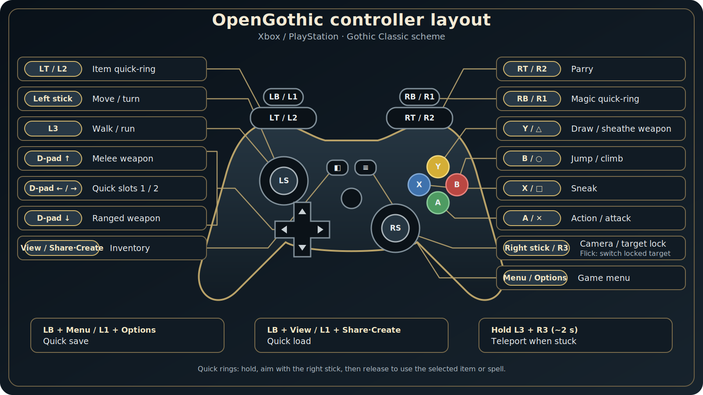

## OpenGothic for iOS

An **unofficial iOS port** of [OpenGothic](https://github.com/Try/OpenGothic) — the open-source
re-implementation of *Gothic II: Night of the Raven*. This fork adds the plumbing to build, sideload,
and play OpenGothic on iPhone/iPad with a Bluetooth controller **or** a full on-screen virtual gamepad.

> ### ⚠️ Work in progress
> This fork is under **active development**. The core loop — gameplay, the on-screen virtual gamepad,
> save/load and haptics — has been **tested and confirmed on a device**, and the hard 30 fps cap is
> lifted (ProMotion). The latest physical-controller response rewrite is CI-green and awaits device
> reconfirmation. It is still rough in places and being tuned, so expect bugs. See
> [`ios/TODO.md`](ios/TODO.md) for the current status and remaining gaps.

> ### Credit
> **The entire engine is the work of [Try](https://github.com/Try) and the OpenGothic contributors.**
> OpenGothic and its rendering engine [Tempest](https://github.com/Try/Tempest) are what make this
> possible — this fork only finishes and wires up the iOS path. Please support the upstream project:
> ⭐ [Try/OpenGothic](https://github.com/Try/OpenGothic) · 💬 [Discord](https://discord.gg/G9XvcFQnn6).
> Not affiliated with or endorsed by the original authors; distributed under the same [license](LICENSE).
>
> Controller glyphs are **[Xelu's Free Controller & Keyboard Prompts](https://thoseawesomeguys.com/prompts)**
> by Nicolae "Xelu" Berbece (CC0).

---

### Prerequisites

*Gothic II: Night of the Raven* is required — OpenGothic ships **no** game assets or scripts. You must
legally own the game and supply its data yourself (see *Language & voices* below for edition notes).

Target: iPhone/iPad on **iOS 15+**, arm64. Best on modern GPUs (A-series / M-series). Locked to landscape.

### Install — download & play (no Mac, no build)

No fork, no compiling — a prebuilt **unsigned `.ipa`** is published on every update. Detailed guide:
**[ios/README-ios.md](ios/README-ios.md)**.

1. **Install with SideStore** (recommended). In SideStore: **Sources → +**, paste
   `https://github.com/tryk016/opengothic-ios/releases/download/latest/apps.json`, then install
   OpenGothic. SideStore signs it with your **free Apple ID** and **auto-refreshes the 7-day certificate
   over Wi-Fi** — no manual reinstalling. *(AltStore or Sideloadly also work, using the `.ipa` from the
   [Releases page](https://github.com/tryk016/opengothic-ios/releases/latest).)*
2. **Add your game data.** Copy the `Data/`, `_work/`, and `system/` folders from your own Gothic II
   install into the app's **Documents** folder (Files app on iOS). Launch and play.

Building it yourself (maintainers only): trigger the [`iOS build`](.github/workflows/ios.yml) Action, or use [`ios/build-ios.sh`](ios/build-ios.sh) + Xcode on a Mac — see the guide.

### Controls

Two input modes; the on-screen overlay hides automatically when a controller is connected.

**Bluetooth controller (Gothic Classic scheme — Xbox / PS5 buttons):**

Text alternative: complete button mapping

| Function | Xbox | PlayStation |
|---|---|---|
| Interact / attack | A | ✕ |
| Draw / sheathe weapon | Y | △ |
| Jump / climb / swim up | B | ○ |
| Sneak / dive | X | □ |
| Move / turn | Left stick | Left stick |
| Camera | Right stick | Right stick |
| Magic quick-ring | RB (hold) | R1 (hold) |
| Item quick-ring | LT (hold) | L2 (hold) |
| Walk / run | L3 | L3 |
| Target lock | R3 | R3 |
| Switch locked target | flick Right stick ← / → | flick Right stick ← / → |
| Parry | RT | R2 |
| Melee / ranged weapon | D-pad ↑ / ↓ | D-pad ↑ / ↓ |
| Quick slots 1 / 2 | D-pad ← / → | D-pad ← / → |
| Inventory | View | Share / Create |
| Game menu | Menu | Options |
| Quick save | LB + Menu | L1 + Options |
| Quick load | LB + View | L1 + Share / Create |
| Unstuck teleport | hold L3 + R3 ~2 s | hold L3 + R3 ~2 s |

- **Quick-rings:** hold RB (magic) or LT (items), aim with the right stick, release to equip/use —
  tiles show real 3D item icons.
- **Quick slots (D-pad ← / →):** bind any inventory item — potion, food, rune, scroll, torch — by
  highlighting it in the inventory and **holding D-pad ← or → for ~0.6 s**. Unassigned slots drink the
  best healing (←) / mana (→) potion. A slot bound to the torch is a toggle: press once to light it,
  press again to stow it back into the inventory.
- **Left-stick response:** Y keeps Gothic's animation-driven movement with press/release hysteresis;
  X turns proportionally to the deflection. A sloped axial guard rejects accidental movement while the
  stick is held mostly sideways (and accidental turning while held mostly forward/back). Returning to
  neutral, opening a ring/UI, disconnecting or resuming the app releases controller-owned actions before
  input can re-arm.
- Config lives in `Documents/Gothic.ini` under `[GAMEPAD]` — `deadZone`, `releaseZone`,
  `crossAxisGuard`, `lookSensitivity`, `invertY`, `triggerThreshold`, `saveSlots`, `noStuckProtect`
  (quick-slot bindings are stored there too).

**On-screen virtual gamepad (no controller):** a full pad is drawn during play — move pad + camera area,
A/B/X/Y, shoulders/triggers, sticks, D-pad, View/Menu — using the Xelu glyphs. Tap a quick-ring button,
drag to aim, release to activate. Menus and dialogues get on-screen D-pad + OK/Back/Skip.

### Language & voices

Language — and whether dialogue has voice-over — comes entirely from **your game data**, not the app.
The Steam release is usually English. For Polish (text + voices) you need Polish game data (e.g. the GOG
*Gold Edition*, which is multi-language, or a Polish install/localization). Once Polish data is in place
it is used automatically; you can also force it with `[GAME] language=2` in a `Gothic.ini` placed in the
app's Documents folder.

Dialogue voice-over lives in `Speech.vdf` / `Speech_Addon.vdf` — these are mounted on devices with ≥4 GB
RAM (skipped on iPhone 7/8 to avoid running out of memory, leaving subtitles only).

### iOS configuration

The copied `Documents/system/Gothic.ini` is never overwritten. On a fresh
install, OpenGothic creates a separate `Documents/Gothic.ini` override with the
complete iOS profile: half-resolution 3D rendering, SSAO off, 512 px shadow
maps, quick-save support and all stable `[GAMEPAD]` defaults (including
`crossAxisGuard=0.12`). Existing root overrides are not auto-populated or
replaced.

The generated profile, upgrade note, override priority, optional FPS cap,
language and diagnostic settings are documented in the
[iOS configuration reference](ios/README-ios.md#ios-configuration).

### Known limitations

- **Still a work in progress** — the core game loop is device-tested, but expect rough edges and
  ongoing tuning (see the notice above and `ios/TODO.md`).
- Save-slot preview thumbnails are not captured on iOS yet (slots show name, date and in-game time, but a
  blank picture).
- Sideload certificate expires weekly (auto-refresh via AltStore/SideStore).
- Mesh shaders are disabled on iOS for GPU compatibility.
- On-screen virtual-pad button layout is a first pass and still needs on-device tuning.
- Radial rings are a single-ring first version; some smaller items in `ios/TODO.md` are not done yet.

### What this fork adds on top of upstream

- **Build/distribution:** cloud build of an unsigned `.ipa` (`.github/workflows/ios.yml`); `ios/` build
  script, sideload/data guide, and submodule patches (`ios/patches/apply-patches.sh`).
- **Controller:** event-driven GameController snapshots (`game/utils/gamepad.*`), a release-safe,
  context-aware dispatcher with left-stick hysteresis and proportional turning that also drives
  menus/dialogues (`game/ui/gamepadinput.*`), native target lock-on, radial magic/item rings with 3D
  item icons (`game/ui/quickring.*`), Remake-style D-pad with two player-assignable quick slots,
  rotating quick-saves, haptics (`game/utils/haptics.*`), stuck-protection, and a `[GAMEPAD]` config.
- **On-screen input:** a full virtual gamepad + menu/dialogue/inventory controls with controller glyphs
  (`game/ui/touchinput.*`, `game/ui/padglyph.*`, `assets/controller/`), a controls-help hint bar and a
  lock-on reticle.
- **iOS lifecycle/robustness:** graceful "data not found" message instead of a crash
  (`game/utils/systemmsg.*`), audio-session setup (`game/utils/audiosession.*`), landscape lock, keep
  the screen awake, Game Mode keys, a save-crash fix, and dialogue voice-over on ≥4 GB devices.
- **Performance & display:** ProMotion unlock + triple-buffered Metal swapchain (lifts the hard 30 fps
  cap), safe-area-aware HUD (nothing hides under the notch / Dynamic Island), configurable shadow
  resolution, and the upscale-based render-scale guide.
- **Engine fixes (upstream-ready):** interaction users no longer float ~1 m above the ground
  (root-vs-feet regression in `Interactive::attach`), menus get their geometry on first open
  (`MenuRoot::setMenu`), and NPC de-overlap no longer parks characters on top of furniture colliders
  (`GameScript::fixNpcPosition`).

---

*For the engine itself — Windows/Linux/macOS builds, features, mods, command-line arguments, graphics
options, and the contribution guide — see the upstream project:*
**[Try/OpenGothic](https://github.com/Try/OpenGothic)**.
