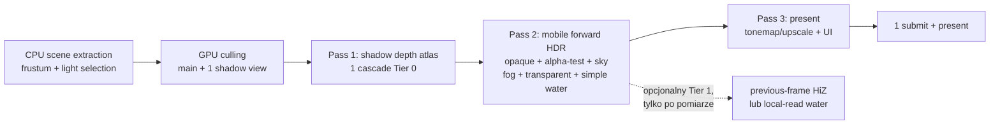

# Plan przebudowy renderera mobilnego Android

- **Status:** Proposed — decyzjogotowy
- **Data:** 2026-07-20
- **Zakres:** wyłącznie branch `android` i urządzenia Android
- **Urządzenie docelowe:** Samsung Galaxy Tab A9 / SM-X115 / Helio G99 / Mali-G57 MC2
- **Decyzja wymagana:** zaakceptować kontrolowaną nową ścieżkę
  `MobileRenderer` wewnątrz obecnych granic OpenGothic–Tempest

## 1. Decyzja w skrócie

Rekomendowana jest **nowa mobilna ścieżka forward renderingu w OpenGothic,
korzystająca z istniejącego backendu Vulkan Tempesta**, a nie przepisywanie
całego Tempesta ani tworzenie drugiego androidowego backendu Vulkan.

To jest gruntowna przebudowa grafu renderowania, ale z kontrolowanym zakresem:

- pozostają: ładowanie zasobów, ASTC, `Device`, `CommandBuffer`, swapchain,
  lifecycle Androida, modele świata, animacje i obecne systemy draw-list;
- powstają: `MobileRenderer`, mobilne shadery forward, mobilna polityka cieni,
  światła i fog oraz jawny, mały render graph;
- dotychczasowy renderer pozostaje przez okres migracji jako ścieżka
  referencyjna i natychmiastowy rollback;
- modyfikacje Tempesta są ograniczone do brakujących prymitywów
  instrumentacji i semantyki TBR, dostarczanych przez
  `android/patches/apply-patches.sh`, bez commitowania submodułu;
- prace nie wchodzą do `master` ani do portu iOS.

Kod nie uzasadnia pełnego rewrite’u backendu. Główne koszty powstają wyżej:
obecny renderer deferred wielokrotnie renderuje geometrię, kończy render passy,
zapisuje bufory pośrednie do pamięci i ponownie je odczytuje. Tempest już
dostarcza działający Vulkan, zasoby, synchronizację, swapchain i jedną kolejkę.
Wymiana tych warstw zwiększyłaby ryzyko bez usunięcia źródła kosztu.

**30 FPS nie jest obietnicą.** Jest mierzalną bramką końcową. Ścieżka mobilna
zostaje uznana za gotową dopiero po spełnieniu p95 na SM-X115.

## 2. Wymagania i kryteria akceptacji

### 2.1. Wydajność

Pomiar wykonujemy na SM-X115, w trybie samolotowym, po rozgrzaniu shaderów i
cache ASTC, bez podłączonego debuggera, przy stałej jasności i tej samej wersji
systemu/sterownika.

Każda scena ma identyczny zapis gry, pozycję i kierunek kamery. Pomiar obejmuje
co najmniej 1800 kolejnych klatek po 30 sekundach rozgrzewki:

1. indoor — pokój Xardasa, ustalona kamera;
2. outdoor — ustalony punkt w Khorinis z widoczną geometrią, NPC i cieniami;
3. stress — ustalona scena z wodą, transparencją, światłami punktowymi lub
   walką; nie zastępuje dwóch głównych scen.

Warunki zaliczenia dla indoor i outdoor:

- p95 całej klatki prezentowanej przez SurfaceFlinger: **<= 33,3 ms**;
- p95 czasu GPU mierzonego timestampami: **<= 27,0 ms**;
- p99 całej klatki: <= 40 ms, bez periodycznych skoków pochodzących z
  przebudowy pipeline’ów;
- brak spadku poniżej 27 FPS dłuższego niż 1 sekunda w 10-minutowej sesji;
- wynik powtarzalny w trzech przebiegach, z raportem temperatury i taktowań.

Menu z wynikiem około 29,7 FPS nie jest dowodem zaliczenia świata gry.

### 2.2. Poprawność obrazu

W każdej scenie muszą pozostać poprawne:

- orientacja, viewport, głębia i kolejność zasłaniania;
- oświetlenie kierunkowe i ambient/irradiance;
- cienie bez białej/przepalonej sceny i bez używania starej mapy z nową
  macierzą;
- efektywny mobilny odpowiednik GI: co najmniej obecne
  `GiMethod::None` + ambient + sky irradiance; wyższe metody GI są osobną
  cechą jakościową i nie mogą przypadkowo wpływać na Tier 0;
- fog, sky, transparencja, cząsteczki i UI;
- woda w jakości zdefiniowanej dla danego tieru, bez odczytu niezainicjalizowanej
  sceny lub głębi.

Tworzymy pary referencyjnych zrzutów legacy/mobile dla dnia, nocy, indoor,
outdoor i wody. Automatyczna różnica obrazu jest wskaźnikiem, a ostateczna
bramka obejmuje checklistę wizualną — renderery nie muszą być pikselowo
identyczne.

### 2.3. Pamięć i stabilność

- PSS procesu po wejściu do świata i ustabilizowaniu cache: **<= 1,5 GB**;
- brak wzrostu PSS > 100 MB po 20 przejściach Home/resume;
- 20 kolejnych Home/resume z tym samym działającym procesem;
- poprawna odbudowa swapchainu po utracie powierzchni;
- brak `VK_ERROR_DEVICE_LOST`, SIGSEGV i istotnych błędów Vulkan Validation;
- działające wejście do menu, nowej gry, zapis/odczyt oraz powrót do świata;
- cache ASTC i dane gry pozostają zgodne z istniejącym portem.

## 3. Fakty pomiarowe i hipoteza kosztu

Punkt wyjścia na SM-X115:

| Element | Wynik p95 / stan |
|---|---:|
| CPU tick | 7,8–9,0 ms |
| animacje | 4,7–4,9 ms |
| pose | 2,3–4,2 ms |
| kodowanie komend | 5,6–5,8 ms |
| `vkQueueSubmit` | około 0,4 ms |
| present + następny acquire | 50,9–62,6 ms |
| stabilna scena Xardasa | około 15–16 FPS |
| menu | około 29,7 FPS |
| PSS z ASTC | 1,28–1,35 GB |

Pełna i połowa rozdzielczości dawały niemal ten sam czas klatki. Zmiana
`sightValue` i map cieni 512→256 również nie pomogła tej scenie. Wyłączenie map
cieni podniosło licznik do około 22,7 FPS, ale zepsuło oświetlenie, więc nie
jest działającą optymalizacją.

Najbardziej prawdopodobny model kosztu:

1. CPU nie blokuje celu 30 FPS w zmierzonej scenie.
2. Długi `present/acquire` jest skutkiem zajętych obrazów swapchainu i pracy
   GPU/kompozytora, a nie kosztem samego wywołania API.
3. Brak istotnej poprawy po obniżeniu rozdzielczości przeczy dominacji prostego
   fragment fill-rate.
4. Mali jest TBR. Tiler najpierw wykonuje transformację geometrii i binning do
   kafelków. Obecne powtarzanie geometrii dla HiZ oraz dwóch cieni może więc
   dominować niezależnie od rozdzielczości koloru.
5. Kolejne render passy z `Preserve`, odczyt G-bufferów, `sceneLinear`,
   `sceneOpaque`, depth oraz storage images mogą wymuszać zewnętrzne
   load/store i round tripy poza pamięć kafelkową.

To są hipotezy wystarczające do wyboru kierunku, ale nie do przypisania czasu
konkretnym passom. Dlatego pierwszym produktem migracji są timestampy GPU.

## 4. Mapa obecnej architektury i grafu passów

Odwołania dotyczą baseline’u `f8cb2347` na branchu `android`.

### 4.1. Granice odpowiedzialności

| Warstwa | Obecna odpowiedzialność | Kluczowe miejsca |
|---|---|---|
| Pętla klatki | command buffer, jeden submit, present, CPU telemetry | `game/mainwindow.cpp`, `MainWindow::render`, okolice wywołań `renderer.draw`, `device.submit`, `device.present` |
| Graf renderowania | kolejność passów, attachmenty, feature policy | `game/graphics/renderer.cpp`, `Renderer::draw(Attachment&, ...)` |
| Scena i draw-listy | obiekty, światła, frustum, delegowanie drawów | `game/graphics/worldview.cpp`, `WorldView::visibilityPass`, `drawHiZ`, `drawGBuffer`, `drawShadow`, `drawTranslucent` |
| Widoczność i indirect | GPU culling per view, payloady, indirect draw | `game/graphics/drawcommands.cpp`, `DrawCommands::visibilityPass`, `drawHiZ`, `drawCommon` |
| Materiały/pipeline’y | warianty G-buffer, depth, shadow, forward | `game/graphics/shaders.cpp`, `Shaders::materialPipeline` |
| Algorytmy shaderów | G-buffer, direct/ambient/point lights, fog, HiZ | `shader/materials/main.frag`, `shader/lighting/*`, `shader/sky/fog.frag`, `shader/hiz/*` |
| Abstrakcja grafiki | Encoder, attachment access, submit | Tempest `Engine/graphics/encoder.*`, `device.*`, `commandbuffer.*` |
| Vulkan | dynamic rendering/render pass, bariery, kolejka, WSI | Tempest `Engine/gapi/vulkan/vcommandbuffer.*`, `vdevice.*`, `vswapchain.*`, `vframebuffermap.*` |

OpenGothic decyduje **co i ile razy** renderować. Tempest decyduje **jak**
zakodować attachmenty, layouty, bariery, submit i present. Nowy graf należy
więc umieścić w OpenGothic, rozszerzając Tempest tylko tam, gdzie jego API nie
potrafi wyrazić timestampów lub bezpiecznej intencji TBR.

### 4.2. Aktywna ścieżka bez zaawansowanych eksperymentów

`Renderer::draw(Attachment&, Encoder&, fId)` wykonuje:

1. `WorldView::preFrameUpdate` i `prepareGlobals`;
2. `visibilityPass(cmd, 0)`:
   - `clusterInit` dla aktywnych widoków,
   - culling widoku `V_HiZ`;
3. `prepareSky`;
4. `drawHiZ`:
   - osobny depth pass statycznych obiektów i landscape;
5. `buildHiZ`:
   - compute odczytuje główny `zbuffer`,
   - zapisuje `hiz.hiZ` i mipy;
6. `visibilityPass(cmd, 1)`:
   - culling `V_Main`,
   - culling `V_Shadow0`,
   - culling `V_Shadow1`;
7. `drawGBuffer`:
   - geometry pass solid + alpha-test,
   - zapis `gbufDiffuse`, `gbufNormal`, depth;
8. `drawShadowMap`:
   - geometry pass `ShadowMap #0`,
   - geometry pass `ShadowMap #1`;
9. opcjonalne VSM/RTSM/SWR/SWRT;
10. `prepareIrradiance`, `prepareExposure`, `prepareSSAO`, `prepareFog`,
    opcjonalne GI/surfels;
11. jeden pass do `sceneLinear`:
    - fullscreen direct sun,
    - fullscreen ambient,
    - wolumeny point lights,
    - fullscreen sky;
12. `stashSceneAux`:
    - fullscreen kopia `sceneLinear` → `sceneOpaque`,
    - fullscreen kopia depth → `sceneDepth`;
13. `drawGWater`:
    - ponowne związanie `sceneLinear`, G-bufferów i depth;
14. sun/moon oraz wszystkie translucent/PFX;
15. reflections i fog jako kolejne fullscreen drawy;
16. tonemapping/upscale do obrazu swapchainu;
17. ponowne związanie swapchainu i UI; inventory może rozpocząć następne
    render passy.

Zaawansowane VSM, RTSM, probe GI, surfels i SSAO są obecnie wyłączone w
bezpiecznym profilu Androida, ale ich zasoby i odgałęzienia zwiększają
złożoność klasy `Renderer`.

### 4.3. Dlaczego obecne passy są kosztowne na TBR

`Tempest::Encoder::implSetFramebuffer` w
`Engine/graphics/encoder.cpp` bezwarunkowo kończy trwający render pass przed
każdym następnym `setFramebuffer`. W Vulkanie `AccessOp::Preserve` mapuje się
na `LOAD`/`STORE`, a `Discard` na `DONT_CARE`
(`Engine/gapi/vulkan/vcommandbuffer.cpp`). To oznacza, że pozornie podobne
operacje na `sceneLinear` nie tworzą automatycznie jednego passu kafelkowego.

Istniejący `ResourceState` generuje layout transitions i bariery, ale API nie
pozwala OpenGothicowi opisać całego mobilnego render graphu ani sprawdzić, czy
passy są scalone. Brakuje też timestamp queries.

Największe strukturalne kandydaty kosztu:

- cztery serie geometrii przed transparencją: HiZ, G-buffer, Shadow0,
  Shadow1;
- compute HiZ pomiędzy depth i właściwym G-bufferem;
- trzy attachmenty G-buffer/depth zapisane na zewnątrz, potem odczytane przez
  direct, ambient i point lights;
- pełnoekranowy `stashSceneAux` i późniejsze odczyty sceny/depth przez wodę;
- fog LUT compute w każdej klatce oraz osobny fullscreen fog;
- wielokrotne `LOAD`/`STORE` HDR przy wodzie, transparencji, reflections,
  fog i UI;
- bariery compute/storage-image, które mogą blokować overlap binningu
  następnej pracy z fragmentami bieżącego passu.

## 5. Warianty architektoniczne

### Wariant A — mobilny profil obecnego renderera deferred

Zakres:

- zachować `Renderer::draw`;
- dalsze feature gates, rzadsze aktualizacje cieni/fog;
- korekta `loadOp/storeOp`;
- ograniczenie passów bez zmiany modelu deferred.

| Wymiar | Ocena |
|---|---|
| Koszt | 1–3 tygodnie |
| Ryzyko poprawności | średnie; zależności passów są ukryte |
| Utrzymanie | niskie początkowo, rosnące wraz z kolejnymi wyjątkami |
| Spodziewany zysk | orientacyjnie 10–30%; niewystarczający, jeśli trzeba prawie 2× |
| Szansa na stabilne 30 FPS | niska–średnia, do potwierdzenia timestampami |

Zalety:

- najmniej nowych plików;
- najłatwiejszy rollback;
- zachowanie pełnej zgodności wizualnej.

Wady:

- G-buffer i zewnętrzne round tripy pozostają;
- trudne bezpieczne usunięcie HiZ lub cieni, bo konsumenci są rozproszeni;
- wcześniejsze skróty renderera tworzyły błędy głębi i stare macierze;
- dalsze warunki platformowe pogarszają czytelność.

Wariant jest dobry wyłącznie jako źródło pomiaru i referencja, nie jako
docelowa architektura.

### Wariant B — nowy `MobileRenderer` forward na Vulkanie Tempesta

Zakres:

- nowa, jawna mobilna ścieżka renderowania w `game/graphics`;
- ponowne użycie `WorldView`, draw-list, zasobów i Vulkan Tempesta;
- opaque/alpha-test oświetlane w jednym forward passie;
- mobilne cienie, fog, water i quality tiers;
- legacy renderer pozostaje w czasie migracji.

| Wymiar | Ocena |
|---|---|
| Koszt | około 6–10 tygodni inżynierskich |
| Ryzyko poprawności | średnie–wysokie, ale izolowane i testowalne |
| Utrzymanie | średnie; dwie ścieżki w migracji, potem jedna mobilna + legacy desktop |
| Spodziewany zysk | hipoteza 1,6–2,3× czasu GPU po usunięciu powtórzeń i round tripów |
| Szansa na stabilne 30 FPS | najwyższa z analizowanych, nadal wymaga p95 |

Zalety:

- usuwa G-buffer i trzy fullscreen passy oświetlenia z Tier 0;
- pozwala utrzymać HDR+depth w jednym passie kafelkowym;
- domyślnie usuwa bieżący depth prepass/HiZ;
- ogranicza liczbę widoków cieni i pracę binningu;
- daje czytelną politykę funkcji i budżetów;
- zachowuje dojrzały backend Vulkan, ASTC i lifecycle.

Wady:

- wymaga nowych wariantów materiałów i rozwiązania point lights;
- jakość wody/reflections musi być świadomie zdefiniowana per tier;
- tymczasowo trzeba utrzymywać legacy/mobile i testy porównawcze;
- część brakującego API instrumentacji wymaga patchy Tempesta.

### Wariant C — osobny androidowy renderer/backend Vulkan poza Tempestem

Zakres:

- bezpośrednie zarządzanie `VkDevice`, pamięcią, pipeline’ami, descriptorami,
  WSI i synchronizacją albo głęboki fork Tempesta tylko dla Androida;
- osobne adaptery zasobów OpenGothic.

| Wymiar | Ocena |
|---|---|
| Koszt | co najmniej 12–20 tygodni, prawdopodobnie więcej |
| Ryzyko poprawności | bardzo wysokie |
| Utrzymanie | bardzo wysokie; duplikacja backendu, WSI, allocatorów i lifecycle |
| Spodziewany zysk | nie większy sam z siebie niż wariant B |
| Szansa na stabilne 30 FPS | nieznana; nowy backend nie usuwa złego grafu automatycznie |

Zalety:

- pełna kontrola nad Vulkanem;
- brak ograniczeń obecnego `Encoder`.

Wady:

- ponowne rozwiązywanie już działających problemów Androida;
- największe ryzyko device loss, wycieków i regresji lifecycle;
- duplikacja uploadu tekstur/ASTC, descriptorów i pipeline cache;
- trudniejsze wsparcie Adreno;
- źródło kosztu leży głównie w grafie OpenGothic, nie w wywołaniu
  `vkQueueSubmit`.

### Rekomendacja

Wybrać **wariant B**. Rewrite ma dotyczyć render pathu i shaderów, nie całego
stosu grafiki.

Wariant A służy jako instrumentowana referencja i rollback. Wariant C wraca do
rozważenia tylko wtedy, gdy etap 0 wykaże konkretny, nieusuwalny koszt lub błąd
w warstwie Tempest, a prototyp B spełni budżety passów, lecz nadal traci czas w
samym backendzie. Obecne dane tego nie pokazują.

## 6. Czego nie robić

- Nie wyłączać map cieni bez kompletnego, zwalidowanego wariantu direct light
  i wizualnego testu dnia/nocy.
- Nie aktualizować mapy cienia i jej macierzy w różnych klatkach.
- Nie pomijać HiZ, dopóki istnieją konsumenci niezbudowanej tekstury.
- Nie zakładać, że half resolution rozwiąże koszt geometrii/binningu.
- Nie optymalizować najpierw CPU, skoro zmierzony CPU mieści się w budżecie.
- Nie dodawać kolejnych nieskoordynowanych `#if __ANDROID__` do starego
  `Renderer::draw`.
- Nie tworzyć dodatkowych submitów per pass; docelowo jest jeden submit na
  klatkę.
- Nie przenosić framebufferów przez compute/storage image, jeśli ten sam
  wynik można utrzymać jako attachment w jednym passie.
- Nie używać szerokich `ALL_COMMANDS`/global memory barriers bez wykazanego
  hazardu.
- Nie commitować zmian bezpośrednio w `lib/Tempest`; Androidowe rozszerzenia
  Tempesta przechodzą przez idempotentny patch script.
- Nie uzależniać etapu 0 od AGI.
- Nie blokować Mali oczekiwaniem na rozwiązanie crasha Adreno.
- Nie dotykać `master` ani kodu iOS.

## 7. Obowiązkowa instrumentacja — etap 0 nie zależy od AGI

SM-X115 nie znajduje się jawnie na oficjalnej liście zweryfikowanych urządzeń
AGI. Dokumentacja Google mówi, że nowe urządzenia z Androidem 12+ powinny mieć
szansę przejść walidację, ale zgodność zależy od OS, OEM, sterownika i GPU.
Dlatego AGI nie jest bramką.

### 7.1. Ścieżka obowiązkowa: Vulkan timestamp queries

Minimalne rozszerzenie Tempesta:

- `AbstractGraphicsApi::CommandBuffer`:
  - `beginGpuScope(uint32_t id, std::string_view name)`;
  - `endGpuScope(uint32_t id)`;
- `Encoder<CommandBuffer>`:
  - RAII `GpuScope`, który emituje jednocześnie timestampy i debug label;
- Vulkan:
  - query pool per command buffer/frame-in-flight;
  - `vkCmdResetQueryPool`;
  - `vkCmdWriteTimestamp2` przy `TOP_OF_PIPE`/pierwszym właściwym stage oraz
    `BOTTOM_OF_PIPE`/ostatnim właściwym stage;
  - odczyt bez `WAIT_BIT` dopiero po sygnale istniejącego fence;
  - konwersja przez `timestampPeriod`;
  - obsługa `timestampValidBits`, wraparound, unavailable i przepełnienia
    liczby scope’ów;
  - dwa lub trzy zestawy wyników zgodne z `MaxFramesInFlight`.

Planowane miejsca patchy Tempesta:

- `Engine/gapi/abstractgraphicsapi.h`;
- `Engine/graphics/encoder.h` i `encoder.cpp`;
- `Engine/graphics/commandbuffer.h/.cpp`;
- `Engine/gapi/vulkan/vcommandbuffer.h/.cpp`;
- `Engine/gapi/vulkan/vdevice.h/.cpp`;
- emisja zmian wyłącznie z `android/patches/apply-patches.sh`.

Integracja OpenGothic:

- `game/mainwindow.cpp` odczytuje ukończone próbki po `fence[cmdId].wait(0)`;
- `game/graphics/renderer.cpp` obejmuje scope’em każdy istniejący pass;
- nowy `game/graphics/gputiming.h/.cpp` agreguje p50/p95/p99, liczbę próbek i
  wersję grafu;
- wynik logowany w maszynowo czytelnym jednym wierszu na okno pomiarowe.

Minimalny zestaw scope’ów baseline:

`visibility-init`, `hiz-occluders`, `hiz-build`, `visibility-main`,
`visibility-shadow0`, `visibility-shadow1`, `gbuffer`, `shadow0`, `shadow1`,
`sky-luts`, `fog-lut`, `direct`, `ambient`, `point-lights`, `stash`,
`water`, `translucent`, `reflections`, `fog`, `tonemap`, `ui`, `frame-gpu`.

Timestampy są narzędziem wyboru architektury, nie pretekstem do dalszego
łatania. Po jednym baseline’ie przechodzimy do nowej ścieżki. Kolejne pomiary
służą do weryfikowania budżetów nowego grafu.

### 7.2. Fallback niezależny od AGI

- Perfetto FrameTimeline: app frame, SurfaceFlinger frame, late present,
  buffer stuffing, GPU composition;
- dostępne na Androidzie 12+ ślady GPU/render stages, jeżeli producent je
  publikuje;
- `dumpsys SurfaceFlinger --latency` dla tej samej warstwy BLAST jako prosty
  pomiar regresji;
- istniejąca CPU telemetry render/submit/present pozostaje aktywna;
- markery CPU `ATrace` używają tych samych nazw passów co timestampy.

### 7.3. AGI i RenderDoc — opcjonalne

AGI/RenderDoc można użyć dopiero, gdy:

1. powstanie osobny debuggable build;
2. build przejdzie Vulkan Validation bez istotnych warningów/errorów;
3. SM-X115 przejdzie walidację AGI.

Niepowodzenie walidacji AGI nie blokuje żadnego etapu. Capture ma wyjaśnić
liczniki/bandwidth/tiler utilization, lecz timestampy pozostają źródłem bramek
CI i testów urządzenia.

## 8. Docelowy mobilny render graph

### 8.1. Graf

### 8.2. Twarde limity grafu

- **1 submit** grafiki na klatkę;
- docelowo **3 hardware render passy**;
- twardy limit **4 passów**, gdy widoczna woda na urządzeniu bez bezpiecznego
  local read wymaga wydzielonej ścieżki Tier 1;
- brak G-bufferów w Tier 0;
- brak `sceneOpaque` i `sceneDepth` w Tier 0;
- brak bieżącego current-frame HiZ depth prepass w Tier 0;
- maksymalnie jeden podstawowy compute/storage round trip dla GPU cullingu;
- shadow, scene i present pozostają w jednym command bufferze.

### 8.3. Pass 1 — cienie

Tier 0:

- jedna stabilna kaskada kierunkowa 512 lub 768 px, ostateczny rozmiar wybiera
  timestamp p95, nie FPS overlay;
- tylko solid + alpha-test;
- pozycje/UV alpha-test bez zbędnych atrybutów;
- macierz i zawartość mapy zawsze aktualizowane razem;
- poza zasięgiem kaskady oświetlenie pozostaje poprawne, lecz bez dynamicznego
  cienia; stosowany jest miękki fade, nie biały fallback.

Tier 1 może użyć dwóch kaskad w jednym atlasie i jednym render passie.
Aktualizacja far cascade co N klatek jest dozwolona wyłącznie ze stabilizowaną
macierzą przechowywaną razem z mapą. Częściowy update atlasu musi wygrać
pomiarowo mimo wymaganego `LOAD`.

### 8.4. Pass 2 — forward HDR

Attachmenty Tier 0:

- HDR `R11G11B10UF`;
- depth `Depth16` lub najlepszy zmierzony wspierany format;
- depth `loadOp=CLEAR`, `storeOp=DONT_CARE`, jeśli żaden późniejszy pass go
  nie odczytuje;
- HDR `loadOp=CLEAR`/`DONT_CARE`, `storeOp=STORE` tylko dlatego, że tonemapping
  odczyta wynik.

Kolejność bez kończenia passu:

1. opaque + alpha-test forward:
   - albedo;
   - direct sun + jedna mapa cienia;
   - ambient + istniejąca 3×2 sky irradiance;
   - ograniczona lista point lights;
   - fog obliczany w materiale lub próbkowany z rzadko aktualizowanego LUT;
2. sky z depth testem;
3. sun/moon;
4. transparencja i PFX;
5. mobilna woda.

Point lights:

- najpierw zmierzyć liczbę widocznych świateł;
- Tier 0 ma deterministyczny limit, np. 8 na kafelek i limit globalny;
- lista kafelków może być przygotowana na CPU i wysłana jako zwarty SSBO,
  ponieważ CPU ma zapas; compute jest dozwolony tylko wtedy, gdy pomiar
  wykazuje niższe p95;
- światła odrzucone wybieramy według wpływu na kamerę/obiekt, nie kolejności
  kontenera.

Fog:

- zachować kolor i transmittance obecnego VolumetricLQ;
- LUT nie może być przebudowywany co klatkę bez zmiany parametrów;
- podstawowy fog jest nakładany w forward shading i sky, więc nie wymaga
  późniejszego odczytu depth i osobnego fullscreen passu;
- pełny volumetric/HQ jest Tier 2 lub opcją po spełnieniu budżetu.

Woda:

- Tier 0 nie odczytuje bieżącego framebufferu jako zwykłej tekstury;
- używa mobilnego shaderu: kolor głębiowy przybliżony z geometrii, Fresnel,
  odbicie sky i poprawny blend;
- brak screen-space refraction jest świadomym limitem jakości, nie błędem;
- Tier 1 może użyć input attachment /
  `VK_KHR_dynamic_rendering_local_read`, jeśli urządzenie wspiera tę ścieżkę i
  capture potwierdzi brak flushu; w przeciwnym razie jeden jawny dodatkowy
  pass tylko, gdy woda jest widoczna.

GI:

- Tier 0 zachowuje efektywną obecną ścieżkę mobile:
  `scene.ambient + sky irradiance + night ambient`;
- probe/surfel GI nie jest włączane przypadkiem;
- Tier 1/2 może dodać dynamiczne GI dopiero po spełnieniu 30 FPS bez niego.

### 8.5. Pass 3 — tonemapping, upscale i UI

- jeden odczyt HDR z Pass 2;
- tonemapping i Lanczos/bilinear mobile upscale do swapchainu;
- UI i liczniki kontynuują ten sam render pass swapchainu;
- inventory używa depth tylko, gdy jest otwarte; osobny transient UI depth
  jest dozwolony, ale nie zmienia zwykłego grafu świata;
- swapchain output ma `storeOp=STORE`; nie wykonujemy ponownego `LOAD` tylko
  po to, aby dorysować UI.

### 8.6. HiZ i depth prepass

Domyślnie Tier 0 nie ma current-frame depth prepass. Obecna ścieżka rysuje
occludery, buduje HiZ compute, a potem ponownie rysuje scenę. Na TBR koszt
binningu może przewyższać oszczędzone fragmenty.

Po etapie 0 porównujemy trzy polityki:

1. brak HiZ, tylko frustum + distance culling;
2. previous-frame HiZ z konserwatywnym rozszerzeniem i wyłączeniem po dużym
   ruchu kamery;
3. mały static-occluder prepass tylko outdoor.

HiZ trafia do danego tieru wyłącznie, jeśli:

- obniża outdoor GPU p95 o co najmniej 2,0 ms;
- nie zwiększa indoor p95;
- nie powoduje popping;
- łączny koszt depth store + compute + bariery + dodatkowa geometria jest
  uwzględniony, a nie raportowany osobno.

## 9. Budżet GPU

Budżety są bramkami projektowymi do potwierdzenia timestampami:

| Obszar | Budżet p95 Tier 0 |
|---|---:|
| GPU culling, upload i bariery przed draw | <= 1,5 ms |
| jedna mapa cienia | <= 4,5 ms |
| opaque + alpha-test forward, direct/ambient/point lights | <= 12,0 ms |
| sky + fog + sun/moon + transparent/PFX + water | <= 4,0 ms |
| tonemapping/upscale + UI | <= 3,0 ms |
| pozostałe przejścia i margines GPU | <= 2,0 ms |
| **łączny GPU frame** | **<= 27,0 ms** |
| SurfaceFlinger/display/pacing slack | <= 6,3 ms |
| **łączna klatka p95** | **<= 33,3 ms** |

Jeśli pojedynczy pass przekroczy budżet, zmiana jego architektury ma
pierwszeństwo przed obniżaniem jakości całego obrazu.

## 10. Zasady TBR dla implementacji

Każdy etap review sprawdza:

- `loadOp=CLEAR` lub `DONT_CARE`, gdy poprzednia zawartość nie jest potrzebna;
- `storeOp=DONT_CARE`/`NONE`, gdy attachment nie jest później używany;
- transient attachments i lazily allocated memory tam, gdzie dane żyją tylko
  w jednym passie;
- brak zewnętrznego odczytu attachmentu w trakcie tego samego logicznego
  passu, chyba że użyto zwalidowanego local read/input attachment;
- brak `vkCmdClear*` zamiast fast clear z loadOp;
- precyzyjne stage/access masks:
  - compute culling write → indirect command read;
  - upload write → vertex/fragment read;
  - shadow depth write → fragment sampled read;
  - HDR color write → tonemap fragment sampled read;
- brak niepotrzebnego compute → storage image → sampled image round trip;
- nieprzerywanie render passu pomiędzy opaque, sky, transparent i wodą Tier 0;
- stały depth compare i depth write dla opaque, aby nie wyłączać hardware
  hidden-surface removal;
- ograniczenie atrybutów w shadow/binning; pozycje mogą otrzymać osobny,
  kompaktowy stream tylko jeśli wzrost PSS pozostanie w budżecie;
- mierzenie geometrii/tilera, nie tylko fragmentów.

Wymaga to audytu `ResourceState` Tempesta. Automatyczna bariera poprawna na
desktopie nie musi być minimalna na tilerze.

## 11. Feature i quality tiers

| Cecha | Tier 0 — Mali-G57 MC2 | Tier 1 — mocniejszy mobile | Tier 2 — reference |
|---|---|---|---|
| Render path | mobile forward | mobile forward | legacy deferred lub high mobile |
| Rozdzielczość | half / dynamic do ustalenia | 0,75–1,0 | 1,0 |
| Cienie słońca | 1 kaskada 512/768 | 2 kaskady atlas | obecna jakość |
| HiZ | off, chyba że outdoor wygra | previous-frame opcjonalnie | obecny/ulepszony |
| SSAO | off | opcjonalnie | on według ustawień |
| GI | ambient + sky irradiance | opcjonalne lekkie GI | probes/surfels |
| Fog | zintegrowany LQ | LQ/HQ po budżecie | pełny |
| Water | bez scene-color read | local read lub 1 dodatkowy pass | pełny |
| Point lights | limit per tile/global | wyższy limit | pełny |
| Descriptor path | scalar-safe fallback obowiązkowy | capability-gated bindless | pełny |

Wybór tieru:

- domyślna tabela GPU/vendor/device;
- capability checks są ważniejsze od samej nazwy GPU;
- użytkownik może wymusić niższy tier;
- awaria pipeline’u mobile nie może automatycznie uruchamiać legacy w połowie
  klatki; wybór następuje przy starcie lub kontrolowanym resecie renderera;
- dynamic resolution może wejść dopiero po stabilnym grafie i timestampach.
  Nie zastępuje redukcji geometrii.

### Adreno

Adreno nie blokuje etapów Mali. Nowa ścieżka od początku:

- ma scalar/slot descriptor path bez wymagania runtime arrays i
  `nonuniformEXT`;
- kompiluje ograniczoną liczbę jawnych pipeline variants;
- przechodzi `spirv-val` i kontrolę capabilities w CI;
- nie wymaga VSM, ray query ani bindless w Tier 0;
- loguje ostateczny reflected layout pipeline’u.

Po osiągnięciu bramek Mali wykonujemy validation-clean build na A23. Jeśli
Samsung/Qualcomm nadal crashuje przy `vkCreateGraphicsPipelines`, powstaje
minimalny reproducer tej znacznie prostszej ścieżki. Nie wracamy do usuniętej
drabiny `TEMP_BISECT_*`.

## 12. Etapowy plan migracji

### Etap 0 — pomiar i kontrakty grafu

**Koszt:** 3–5 dni.

**Wejście:**

- bezpieczny `latest-android` i legacy renderer;
- stałe save’y/pozycje testowe;
- SM-X115 dostępny przez ADB.

**Zakres:**

- wbudowane timestamp queries i RAII scope’y;
- wspólne nazwy scope’ów dla timestamp/debug label/ATrace;
- skrypt powtarzalnego uruchomienia indoor/outdoor;
- raport CSV/JSON z GPU p50/p95/p99, SurfaceFlinger, temperaturą i PSS;
- validation-clean debug build jako osobny wariant;
- baseline obecnego grafu.

**Pliki/API:**

- Tempest — wyłącznie przez `android/patches/apply-patches.sh`:
  `abstractgraphicsapi.h`, `encoder.*`, `commandbuffer.*`,
  `vcommandbuffer.*`, `vdevice.*`;
- OpenGothic:
  `game/mainwindow.cpp`, `game/graphics/renderer.cpp`,
  nowe `game/graphics/gputiming.*`;
- Android:
  `android/app/build.gradle`, nowe `android/perf/*`;
- CI: `.github/workflows/android.yml` tylko dla kompilacji i testu shaderów,
  nie dla fałszywego gate’u FPS bez urządzenia.

**Inwarianty:**

- instrumentacja wyłączona ma pomijalny koszt;
- instrumentacja włączona nie zmienia grafu ani obrazu;
- query result jest odczytywany dopiero po istniejącym fence;
- brak synchronicznego `vkGetQueryPoolResults(...WAIT...)` w hot path.

**Wyjście:**

- co najmniej 95% klatek ma komplet timestampów;
- suma scope’ów jest zgodna z `frame-gpu` w tolerancji narzutu;
- baseline dla indoor i outdoor jest zapisany;
- powstaje decyzja: ile kosztują geometry passes, fullscreen passes i
  bariery. Architektura B pozostaje celem; wyniki ustalają kolejność pracy.

**Rollback:** compile flag usuwa całą instrumentację; legacy APK pozostaje
identyczny funkcjonalnie.

### Etap 1 — izolowana pionowa ścieżka `MobileRenderer`

**Koszt:** 1,5–2,5 tygodnia.

**Zależność:** etap 0.

**Zakres:**

- `Renderer` pozostaje fasadą dla MainWindow i UI;
- obecny graf zostaje nazwany ścieżką legacy;
- nowy `MobileRenderer` otrzymuje ten sam `WorldView`, `Camera`, frame id i
  wynik swapchainu;
- implementacja solid/alpha-test forward, direct + ambient/irradiance,
  jedna mapa cienia, sky, fog LQ, transparencja/PFX, Tier-0 water,
  tonemapping i UI;
- przełącznik startowy `rendererPath=legacy|mobile`, początkowo legacy;
- osobne pipeline variants i shadery mobile.

**Pliki:**

- `game/graphics/renderer.h/.cpp` — fasada i wybór ścieżki;
- nowe:
  - `game/graphics/mobile/mobile_renderer.h/.cpp`,
  - `game/graphics/mobile/mobile_render_graph.h/.cpp`,
  - `game/graphics/mobile/mobile_quality.h/.cpp`,
  - `game/graphics/mobile/mobile_lights.h/.cpp`;
- `game/graphics/worldview.h/.cpp`;
- `game/graphics/visualobjects.h/.cpp`;
- `game/graphics/drawcommands.h/.cpp`;
- `game/graphics/shaders.h/.cpp`;
- `shader/mobile/mobile_forward.frag`,
  `shader/mobile/mobile_water.frag`,
  `shader/mobile/mobile_tonemap.frag`,
  potrzebne warianty vertex/alpha-test;
- `shader/CMakeLists.txt`.

**API sceny:**

- jawne mobile views: `Main` i `ShadowNear`;
- jawne grupy drawów: opaque, alpha-test, water, transparent, PFX;
- brak dostępu mobile pathu do legacy G-bufferów;
- point-light list jest zwarta i ma jawny limit tieru.

**Inwarianty:**

- legacy path nie zmienia obrazu;
- mobile nie próbuje próbkować niezainicjalizowanego G-bufferu/HiZ;
- shadow texture i shadow matrix stanowią jeden versioned frame resource;
- wszystkie obiekty zapisujące depth używają zgodnej konwencji;
- UI działa w pełnej rozdzielczości.

**Wyjście:**

- menu, indoor i outdoor renderują się poprawnie;
- visual checklist lighting/depth/GI baseline/fog przechodzi;
- lifecycle 20× przechodzi;
- PSS <= 1,5 GB;
- wszystkie mobile shadery przechodzą CI;
- wynik FPS jest raportowany, ale jeszcze nie musi spełniać 30 FPS.

**Rollback:** ustawienie `rendererPath=legacy` bez zmiany danych/save/cache.

### Etap 2 — TBR, cienie i domknięcie budżetu GPU

**Koszt:** 2–4 tygodnie.

**Zależność:** poprawna pionowa ścieżka etapu 1.

**Zakres:**

- zredukowanie grafu do 3 passów / 1 submit;
- wyeliminowanie G-buffer, stash i per-frame fog fullscreen z mobile;
- poprawne load/store/transient attachmenty;
- precyzyjne bariery;
- jedna kaskada Tier 0 i opcjonalny atlas Tier 1;
- porównanie polityk HiZ;
- point-light culling CPU vs compute;
- ograniczenie atrybutów shadow/binning;
- usunięcie pipeline creation z aktywnej rozgrywki;
- ewentualny pipeline cache/warm-up.

**Pliki:**

- wszystkie `game/graphics/mobile/*`;
- `game/graphics/drawcommands.*`, `drawclusters.*`, `drawbuckets.*`;
- `shader/mobile/*`;
- `android/patches/apply-patches.sh` dla semantyki Tempest TBR;
- Tempest przez patch: `encoder.*`, `vcommandbuffer.*`,
  `vframebuffermap.*`, `vtexture.*` tylko jeśli potrzebne są transient/lazy
  attachments lub local read.

**Inwarianty:**

- jeden submit;
- 3 passy normalnie, najwyżej 4 z widoczną wodą Tier 1;
- brak szerokich barier bez komentarza z hazardem;
- brak mapy cienia użytej z inną wersją macierzy;
- brak odczytu attachmentu, którego storeOp pozwolił odrzucić zawartość;
- brak pogorszenia visual checklist i lifecycle.

**Test na Helio po każdej podfazie:**

- timestamp p95 per pass;
- SurfaceFlinger p95;
- indoor + outdoor;
- temperatura i throttling;
- porównanie 10-minutowe;
- PSS i liczba pipeline compilations.

**Wyjście:**

- każdy pass mieści się w budżecie z sekcji 9;
- GPU p95 <= 27 ms;
- frame p95 <= 33,3 ms indoor i outdoor w trzech przebiegach;
- jeśli bramka nie przechodzi, raport wskazuje konkretny pass. Nie ogłaszamy
  30 FPS na podstawie średniej.

**Rollback:** mobile path pozostaje opcjonalny; ostatni działający podetap ma
osobny feature flag, legacy pozostaje dostępny.

### Etap 3 — tiering, Adreno i bezpieczne wdrożenie

**Koszt:** 1,5–3 tygodnie.

**Zależność:** etap 2 spełnia bramki na Mali.

**Zakres:**

- finalne Tier 0/1/2;
- tabela capabilities i fallback scalar;
- test A23/Adreno validation-clean;
- pipeline cache i test cold/warm start;
- automatyczne raporty regresji;
- mobile jako domyślna ścieżka na Androidzie dopiero po pełnej macierzy;
- legacy pozostaje przez co najmniej jeden cykl release.

**Wyjście:**

- SM-X115 spełnia wszystkie kryteria;
- Adreno ma działający Tier 0 albo udokumentowany minimalny reproducer i
  jawny compatibility block;
- release notes podają rzeczywistą macierz;
- rollback do legacy jest sprawdzony na urządzeniu.

## 13. Test matrix i bramki

| Test | SM-X115 Mali | A23 Adreno | Pixel AVD | CI |
|---|---:|---:|---:|---:|
| Fixed indoor p95 | obowiązkowy | po Mali | nie | raport urządzenia |
| Fixed outdoor p95 | obowiązkowy | po Mali | nie | raport urządzenia |
| Visual goldens | obowiązkowy | obowiązkowy po uruchomieniu | smoke | kontrola plików |
| PSS/ASTC | obowiązkowy | smoke | nie | format/cache tests |
| 20× Home/resume | obowiązkowy | po uruchomieniu | smoke | nie |
| Vulkan Validation | debug | obowiązkowy przed AGI | debug | brak błędów statycznych |
| SPIR-V validation | tak | tak | tak | obowiązkowy |
| Timestamp completeness | obowiązkowy | po uruchomieniu | opcjonalny | unit/compile |
| AGI/RenderDoc | opcjonalny | opcjonalny | AGI unsupported | nie |

CI gates:

- oba ABI budują się;
- `spirv-val` dla wszystkich mobile variants;
- Tier 0 scalar nie zawiera runtime descriptor arrays/non-uniform capability;
- test deklaracji grafu sprawdza liczbę passów, attachment lifetime i
  niedozwolone read-after-discard;
- profiler poprawnie obsługuje wraparound i unavailable;
- shader/pipeline manifest jest deterministyczny;
- Markdown i plan nie uruchamiają publikacji APK.

Testy wydajności pozostają device gates. Hosted CI bez SM-X115 nie może
oznaczyć 30 FPS jako zaliczone.

## 14. Ryzyka i działania ograniczające

| Ryzyko | Skutek | Ograniczenie |
|---|---|---|
| Rewrite forward zmienia obraz | regresje lighting/fog/water | legacy goldens, pionowa ścieżka, checklisty |
| Point lights są drogie w forward | fragment bottleneck | limit per tile, CPU list, timestamp |
| Jedna kaskada pogarsza outdoor | widoczne zanikanie cienia | stabilna strefa + fade, Tier 1 atlas |
| Brak prepass zwiększa overdraw | outdoor wolniejszy | trzy mierzone polityki HiZ |
| Tempest ukrywa zbyt szerokie bariery | utrata overlap TBR | barrier audit + capture opcjonalny |
| Timestamp API zmienia submoduł | drift patcha | idempotentny fail-loud patch, żadnego commitu submodułu |
| AGI nie działa na SM-X115 | brak vendor counters | timestampy obowiązkowe, Perfetto/SF fallback |
| Nowe shadery crashują Adreno | brak drugiego urządzenia | scalar Tier 0, validation, minimal reproducer |
| Dwie ścieżki zwiększają utrzymanie | rozjazd funkcji | legacy zamrożony, mobile jawnie odseparowany |
| Dynamiczne obniżanie jakości maskuje problem | niestabilny obraz/FPS | najpierw stałe pass budgets, DRS dopiero później |
| Dodatkowy position-only stream zwiększa PSS | >1,5 GB | pomiar pamięci i aktywacja tylko po zysku GPU |

## 15. Pierwsze konkretne taski implementacyjne

1. Dodać format stałych scen i skrypt ADB zbierający log, PSS, thermal,
   SurfaceFlinger i wersję sterownika.
2. Zaprojektować i zaimplementować `GpuScope` oraz ring timestamp queries w
   patchowanej warstwie Tempesta.
3. Oznaczyć wszystkie passy legacy i zebrać baseline indoor/outdoor.
4. Zapisać raport: koszt HiZ, G-buffer, obu cieni, lighting, fog, water,
   tonemap i UI.
5. Dodać fasadę wyboru `legacy|mobile` bez zmiany legacy output.
6. Utworzyć pusty `MobileRenderGraph` z walidacją attachment lifetime i
   licznika passów.
7. Zbudować forward opaque/alpha-test z direct + ambient/irradiance.
8. Dodać jedną poprawną mapę cienia wraz z versioned matrix.
9. Dodać sky, zintegrowany fog, transparent/PFX i Tier-0 water bez
   framebuffer read.
10. Połączyć tonemapping/upscale oraz UI w jednym swapchain passie.
11. Zmierzyć mobile vertical slice i ustawić kolejność optymalizacji według
    timestamp p95.
12. Dopiero wtedy wykonać barrier/load-store audit i eksperymenty HiZ.

## 16. Szacunkowy koszt i punkt przerwania

| Etap | Szacunek |
|---|---:|
| Etap 0 — instrumentacja | 3–5 dni |
| Etap 1 — funkcjonalny MobileRenderer | 1,5–2,5 tygodnia |
| Etap 2 — TBR i 30 FPS gate | 2–4 tygodnie |
| Etap 3 — tiers/Adreno/release | 1,5–3 tygodnie |
| **Łącznie** | **około 6–10 tygodni inżynierskich** |

Po każdym etapie istnieje działający rollback. Jeżeli po etapie 2 wszystkie
jawne passy mieszczą się w budżetach, lecz `frame-gpu` nadal ma dużą
niewyjaśnioną lukę w warstwie Tempest, dopiero wtedy otwieramy ADR dotyczący
głębszego backendu. Bez takiego dowodu wariant C pozostaje odrzucony.

## 17. Oficjalne źródła

- [Khronos — Tile Based Rendering Best Practices](https://docs.vulkan.org/guide/latest/tile_based_rendering_best_practices.html)
- [Khronos — Appropriate use of render pass attachments](https://docs.vulkan.org/samples/latest/samples/performance/render_passes/README.html)
- [Khronos — `vkCmdWriteTimestamp2`](https://docs.vulkan.org/refpages/latest/refpages/source/vkCmdWriteTimestamp2.html)
- [Android — AGI supported devices](https://developer.android.com/agi/supported-devices)
- [Android — AGI quickstart i device validation](https://developer.android.com/agi/start)
- [Perfetto — Android FrameTimeline](https://perfetto.dev/docs/data-sources/frametimeline)
- [Perfetto — GPU data sources](https://perfetto.dev/docs/data-sources/gpu)

Źródła potwierdzają, że na TBR kluczowe są prawidłowe load/store, transient
attachments, unikanie zewnętrznych odczytów framebufferów i precyzyjne
bariery. Dokumentacja AGI nie wymienia jawnie SM-X115; urządzenia Android 12+
mogą przejść walidację, ale nie jest to gwarantowane.

## 18. Konkluzja

Należy przepisać **render path**, nie cały renderer/backend od zera.
`MobileRenderer` forward w istniejących granicach Tempesta usuwa źródła
kosztu, zachowując działające zasoby, Vulkan WSI, ASTC i lifecycle.

Pierwszy etap dostarcza obowiązkowe timestampy niezależne od AGI. Następne
etapy budują mały graf: jedna mapa cienia, jeden forward HDR pass, jeden
present/UI pass i jeden submit. Sukcesem jest dopiero zmierzone
`p95 <= 33,3 ms` indoor i outdoor na SM-X115 przy poprawnym obrazie,
`PSS <= 1,5 GB` i bez regresji lifecycle.
